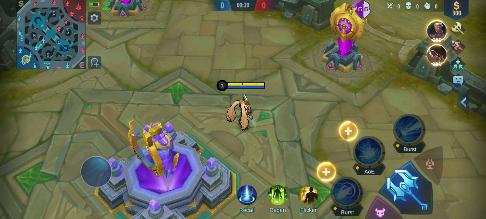
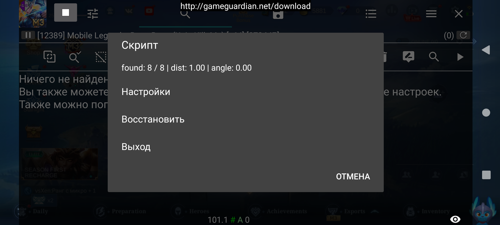
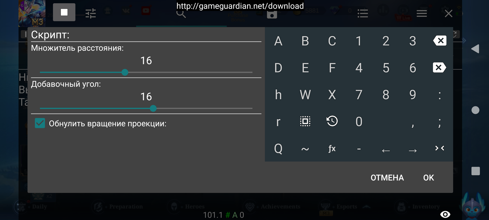
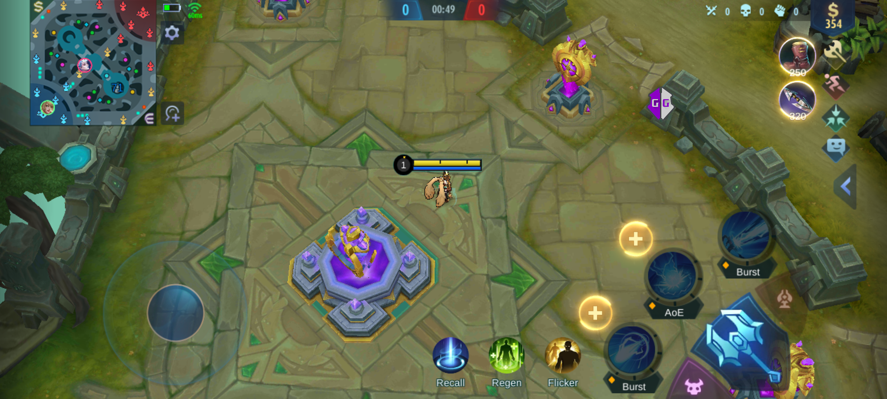

# MLBB-CameraEdit

Скрипт GameGuardian для удобной настройки высоты камеры и её ракурса.

## Как использовать

- Скопируйте все lua-скрипты из репозитория в одну папку на своём устройстве.
- Запустите игру. Дождитесь загрузки главного экрана.
- Запустите CameraEdit.lua
- После окончания поиска в окне **открытого** GameGuardian появится плавающая кнопка.
  При нажатии на неё будет открываться меню с для редактирования параметров камеры.
